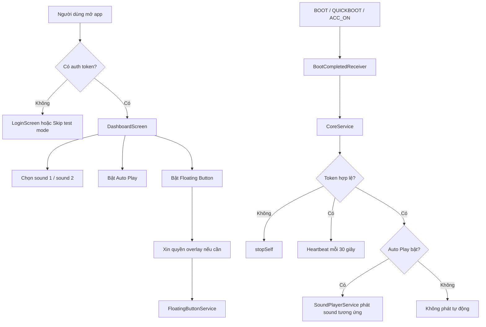

# AutoGreeting

AutoGreeting là ứng dụng Android native cho màn hình xe hơi, Android Automotive hoặc Android Box gắn thêm. Ứng dụng tập trung vào một việc chính: tự phát lời chào khi xe bật điện hoặc khởi động, đồng thời cung cấp âm thanh tạm biệt để người dùng phát thủ công khi thiết bị vẫn còn hoạt động.

Ứng dụng cũng có bảng cấu hình bằng Jetpack Compose, nút điều khiển nổi trên màn hình, cơ chế chạy nền bằng Foreground Service, heartbeat về server, và khung đồng bộ âm thanh qua WorkManager.

## Bộ tài liệu

| Tệp | Mục đích |
| --- | --- |
| [`README.md`](README.md) | Tổng quan sản phẩm, tính năng, quyền Android, runtime flow và build/test. |
| [`PLAN.md`](PLAN.md) | Kế hoạch kỹ thuật, nguyên tắc phát triển, ưu tiên hardening và regression map. |
| [`RELEASE_GATE.md`](RELEASE_GATE.md) | Checklist chặn phát hành cho APK cài trên màn hình xe hoặc phân phối qua Google Play. |
| [`docs/TECHNICAL_ARCHITECTURE.md`](docs/TECHNICAL_ARCHITECTURE.md) | Kiến trúc module, UI, service, DI, persistence, API và trạng thái toàn cục. |
| [`docs/MAIN_FLOW.md`](docs/MAIN_FLOW.md) | Luồng mở app, login, chọn âm thanh, boot/ACC, autoplay, floating button, heartbeat và logout. |
| [`docs/DEVICE_OPTIMIZATION.md`](docs/DEVICE_OPTIMIZATION.md) | Quyền Android, tối ưu pin/OEM, ACC intent, overlay, Accessibility và ma trận QA thiết bị. |

## Mục tiêu sản phẩm

AutoGreeting phục vụ các màn hình xe cần cá nhân hóa trải nghiệm khởi động:

- Phát âm thanh lời chào khi nhận `BOOT_COMPLETED`, `QUICKBOOT_POWERON` hoặc `ACC_ON`.
- Cho phép người dùng chọn hai file âm thanh riêng: lời chào và tạm biệt.
- Cho phép phát âm thanh tạm biệt thủ công từ floating button. Không cam kết tự phát sau `ACC_OFF`, vì đa số thiết bị đã tắt hoặc ngủ ngay khi mất ACC.
- Cho phép bật/tắt chế độ tự phát bằng tùy chọn `Auto Play`.
- Hiển thị phím nổi để phát hoặc dừng từng âm thanh mà không cần mở lại app.
- Duy trì một service nền để gửi heartbeat và kiểm tra cập nhật định kỳ.
- Có Accessibility Service làm bề mặt dự phòng cho các màn hình xe OEM chặn hoặc thay đổi hành vi broadcast.

## Tổng quan kỹ thuật

| Hạng mục | Giá trị hiện tại |
| --- | --- |
| Application ID | `com.example.carchatbot` |
| Module Android | `app` |
| Min SDK | 24 |
| Target SDK | 34 |
| Compile SDK | 34 |
| UI | Jetpack Compose + Material 3 |
| DI | Hilt |
| Network | Retrofit + Gson converter |
| Persistence | Android DataStore Preferences |
| Background | Foreground Service, BroadcastReceiver, WorkManager |
| Audio | `MediaPlayer` trong `SoundPlayerService` |
| Overlay | `WindowManager` + `TYPE_APPLICATION_OVERLAY` |

## Chức năng chính

### 1. Mở ứng dụng và gate đăng nhập

`MainActivity` là entry point duy nhất. Khi mở app, Activity đọc `authToken` từ `UserPreferencesRepository`.

- Nếu chưa có token và không ở chế độ test, app hiển thị `LoginScreen`.
- Nếu đã có token hoặc người dùng chọn skip, app hiển thị `DashboardScreen`.
- `LoginViewModel` hiện mô phỏng đăng nhập thành công sau delay 1.5 giây. Logic gọi API login thật chưa được nối vào ViewModel.

### 2. Cấu hình âm thanh

`DashboardScreen` dùng `ActivityResultContracts.OpenDocument()` để chọn file `audio/*`.

- File lời chào được lưu vào key `sound_uri_1`.
- File lời tạm biệt được lưu vào key `sound_uri_2`.
- App gọi `takePersistableUriPermission()` để giữ quyền đọc URI sau khi app restart.
- Người dùng có thể reset từng file về trạng thái trống.

### 3. Tự phát khi boot hoặc ACC

`BootCompletedReceiver` lắng nghe các action:

- `android.intent.action.BOOT_COMPLETED`
- `android.intent.action.QUICKBOOT_POWERON`
- `android.intent.action.ACC_ON`
- `android.intent.action.ACC_OFF`

Khi nhận action hợp lệ, receiver start `CoreService` và truyền action gốc sang service. `CoreService` kiểm tra token, kiểm tra tùy chọn floating button, sau đó quyết định phát âm thanh cho các tín hiệu khởi động hoặc bật ACC:

- Boot, quick boot hoặc ACC ON -> phát sound 1.
- ACC OFF chỉ nên coi là tín hiệu chẩn đoán hoặc fallback cho thiết bị đặc biệt còn giữ Android runtime đủ lâu. Không coi đây là luồng phát tạm biệt đáng tin cậy.

### 4. CoreService và heartbeat

`CoreService` là Foreground Service loại `specialUse`. Khi `onCreate()` chạy, service:

- Tạo notification channel `AutoGreetingService`.
- Gọi `startForeground()`.
- Lên lịch vòng lặp `Handler` mỗi 30 giây.
- Mỗi chu kỳ gọi `performHeartbeat()` và `checkForUpdates()`.

Heartbeat gọi `IotStatusRepository.performHeartbeat(token)` trên `Dispatchers.IO`, gửi request `POST ping` kèm `Authorization: Bearer <token>`.

### 5. Floating Button

`FloatingButtonService` tạo overlay bằng `WindowManager`. Điểm đáng chú ý là service tự triển khai:

- `LifecycleOwner`
- `SavedStateRegistryOwner`
- `ViewModelStoreOwner`

Cách này cho phép `ComposeView` chạy bên ngoài Activity. Nút nổi gồm hai action:

- Lời chào: biểu tượng campaign, phát hoặc dừng sound 1.
- Lời tạm biệt: biểu tượng handshake, phát hoặc dừng sound 2.

Nút có thể kéo thả bằng `detectDragGestures()`.

### 6. Playback service

`SoundPlayerService` nhận hai action:

- `ACTION_PLAY_GREETING`
- `ACTION_STOP_GREETING`

Khi phát, service tạo `MediaPlayer` từ URI, cập nhật `SoundPlayerState.isPlaying` và `SoundPlayerState.currentSoundId`. Khi phát xong hoặc bị dừng, service release MediaPlayer và reset state.

### 7. Đồng bộ âm thanh từ server

`DownloadWorker` đã có khung retry và hàm `downloadAndSave(...)`, nhưng `doWork()` hiện mới ghi log rồi trả `Result.success()`. Logic kiểm tra `check-update`, tải file, lưu nội bộ và cập nhật DataStore chưa được nối hoàn chỉnh.

### 8. YouTube shortcut

Dashboard có trường `YouTube Shortcut` và nút `Tạo lối tắt`, nhưng handler của nút hiện là placeholder. `YtProxyActivity` đã được khai báo trong Manifest nhưng flow tạo shortcut chưa hoàn thiện.

## Quyền Android

Manifest hiện khai báo:

| Quyền / Feature | Vai trò |
| --- | --- |
| `android.hardware.type.automotive` | Đánh dấu app yêu cầu môi trường automotive. |
| `INTERNET` | Gọi login, ping, check-update và download. |
| `RECEIVE_BOOT_COMPLETED` | Nhận boot broadcast. |
| `FOREGROUND_SERVICE` | Chạy service nền có notification. |
| `FOREGROUND_SERVICE_SPECIAL_USE` | Tương thích foreground service special use trên Android 14+. |
| `SYSTEM_ALERT_WINDOW` | Hiển thị floating button trên app khác. |
| `WAKE_LOCK` | Dự phòng giữ CPU khi cần xử lý nền. |
| `BIND_ACCESSIBILITY_SERVICE` | Cho `MyAccessibilityService`, người dùng phải bật thủ công trong Settings. |

## Dữ liệu và persistence

`UserPreferencesRepository` dùng DataStore file `user_prefs`.

| Key | Ý nghĩa |
| --- | --- |
| `sound_uri_1` | URI file lời chào. |
| `sound_uri_2` | URI file tạm biệt. |
| `youtube_link` | Link YouTube do người dùng nhập. |
| `auto_play` | Bật/tắt tự phát khi có boot/ACC event. |
| `auth_token` | Token đăng nhập. |
| `floating_button` | Bật/tắt overlay floating button. |

Trạng thái playback dùng `SoundPlayerState` với `MutableStateFlow`, không lưu bền qua restart.

## Backend API

`NetworkModule` hiện hard-code base URL:

```text
http://103.118.28.117/api/
```

`IotApiService` định nghĩa các endpoint:

| Endpoint | Phương thức | Mục đích |
| --- | --- | --- |
| `login` | `POST` | Đăng nhập bằng phone/password. |
| `ping` | `POST` | Gửi heartbeat và batch log. |
| `check-update` | `GET` | Kiểm tra bản âm thanh mới. |
| dynamic URL | `GET @Streaming` | Tải file âm thanh. |
| dynamic URL | `GET` | Lấy trạng thái IoT. |

Trước release, base URL nên được đưa ra build config hoặc cấu hình môi trường thay vì hard-code trong source.

## Luồng runtime tổng quát



## Biên dịch và chạy

Yêu cầu:

- Android Studio hoặc Android Gradle Plugin tương thích 8.2.2.
- JDK phù hợp với Android Studio hiện tại.
- Android SDK 34.
- Thiết bị thật, emulator hoặc màn hình Android xe hơi.

Workspace local hiện có `gradle/wrapper/gradle-wrapper.properties` nhưng chưa thấy script `gradlew` / `gradlew.bat` ở root. Nếu wrapper script được bổ sung, lệnh debug build mong muốn là:

```powershell
.\gradlew.bat :app:assembleDebug
```

Nếu chưa có wrapper script, build qua Android Studio hoặc dùng Gradle đã cài trên máy:

```powershell
gradle :app:assembleDebug
```

APK debug hiện từng xuất hiện ở:

```text
app/build/outputs/apk/debug/Chào xe fake.apk
```

Tên APK này là artifact local, không nên coi là quy ước release ổn định.

## Kiểm thử và chất lượng

Các bước tối thiểu trước khi phát hành APK:

- Build debug sạch.
- Cài APK lên ít nhất một màn Android xe thật hoặc Android Box.
- Mở app, vào dashboard, chọn hai file audio.
- Bật/tắt Auto Play và Floating Button.
- Cấp quyền overlay và xác nhận floating button hiển thị trên app khác.
- Gửi broadcast giả lập cho `BOOT_COMPLETED`, `QUICKBOOT_POWERON`, `ACC_ON` nếu thiết bị cho phép. `ACC_OFF` chỉ kiểm tra như tín hiệu chẩn đoán, không dùng làm tiêu chí phát tạm biệt bắt buộc.
- Kiểm tra logcat của `CoreService`, `BootReceiver`, `SoundPlayerService`, `DownloadWorker`.
- Kiểm tra service không crash khi thiếu token, thiếu URI âm thanh hoặc thiếu quyền overlay.

## Phát hành và rủi ro Google Play

Rủi ro lớn nhất của AutoGreeting nằm ở môi trường thiết bị:

- Mỗi hãng màn hình xe có thể phát ACC intent khác nhau.
- Một số ROM kill service nền dù app đang có Foreground Service.
- Overlay permission thường bị ẩn trong UI cài đặt của Android Box.
- Accessibility permission là quyền nhạy cảm nếu phân phối qua Google Play.
- `FOREGROUND_SERVICE_SPECIAL_USE` cần mô tả rõ lý do sử dụng trên Android 14+.
- App đang dùng cleartext HTTP, cần đánh giá lại trước khi phát hành rộng.

Xem checklist chi tiết trong [`RELEASE_GATE.md`](RELEASE_GATE.md).
