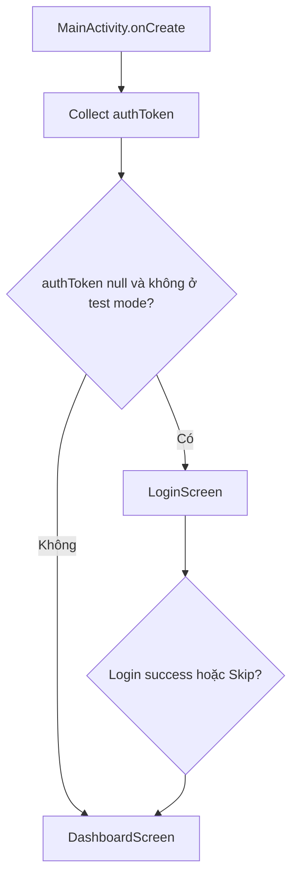
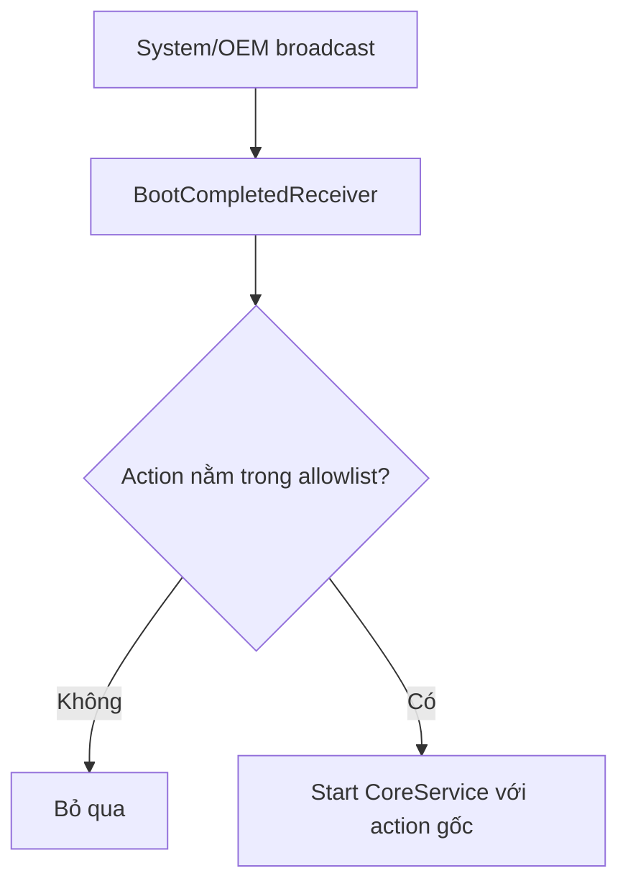
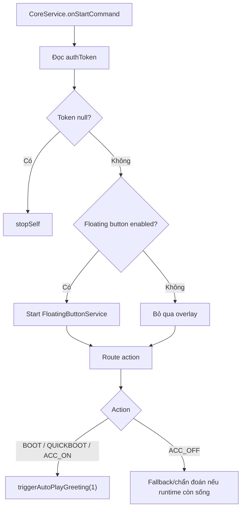
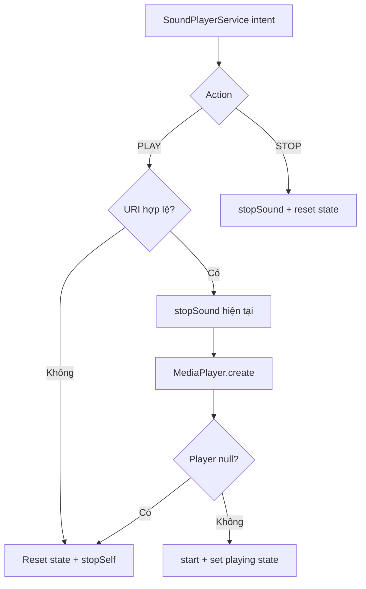

# Luồng chính của AutoGreeting

Tài liệu này mô tả các luồng runtime quan trọng của AutoGreeting theo source local đang mở. Trọng tâm là các đường chạy ảnh hưởng trực tiếp tới trải nghiệm trên màn hình xe: mở app, chọn âm thanh, bật autoplay, nhận boot/ACC, phát âm thanh, floating button và heartbeat.

## 1. Luồng mở ứng dụng

Điểm vào là `MainActivity`.

1. Activity gọi `enableEdgeToEdge()`.
2. Hilt inject `UserPreferencesRepository`.
3. Compose content được render trong `MaterialTheme`.
4. Activity collect `authToken` từ DataStore.
5. Activity giữ state local `isTestingMode`.
6. Nếu `authToken == null` và chưa skip test mode, hiển thị `LoginScreen`.
7. Nếu có token hoặc người dùng skip, hiển thị `DashboardScreen`.



Điểm cần lưu ý:

- Skip test mode chỉ là state trong Activity, không persist.
- Login success hiện chưa lưu token thật vì `LoginViewModel` đang mô phỏng thành công.

## 2. Luồng đăng nhập

`LoginViewModel.login(phone, password)` hiện chạy:

1. Set state `Loading`.
2. Delay 1.5 giây.
3. Set state `Success`.
4. Nếu exception, set state `Error`.

Flow production mong muốn nhưng chưa nối:

1. Validate phone/password.
2. Gọi `IotStatusRepository.login(...)`.
3. Nhận `access_token`.
4. Lưu token bằng `UserPreferencesRepository.saveToken(...)`.
5. DataStore emit token mới.
6. `MainActivity` tự chuyển sang Dashboard.

Rủi ro hiện tại:

- `IotStatusRepository.login(...)` có gọi API nhưng chỉ trả boolean success.
- `LoginViewModel` chưa nhận `UserPreferencesRepository`, nên chưa thể lưu token.
- Nếu không dùng skip test mode, app chưa có đường production login hoàn chỉnh.

## 3. Luồng setup Dashboard

`DashboardScreen` collect các state từ `MainViewModel`:

- `savedSoundUri1`
- `savedSoundUri2`
- `youtubeLink`
- `autoPlayEnabled`
- `isFloatingButtonEnabled`
- `SoundPlayerState.isPlaying`
- `SoundPlayerState.currentSoundId`

Dashboard gồm các cụm:

1. Header Auto Greeting.
2. Sound 1: Lời chào.
3. Sound 2: Tạm biệt.
4. Toggle Tự động phát.
5. Toggle Phím điều khiển.
6. YouTube Shortcut.
7. Logout.

## 4. Luồng chọn file âm thanh

Dashboard dùng `rememberLauncherForActivityResult(ActivityResultContracts.OpenDocument())`.

Khi người dùng bấm `Thay đổi âm thanh`:

1. ViewModel set `selectedSoundIndex` = 1 hoặc 2.
2. File picker mở với MIME `audio/*`.
3. Người dùng chọn URI.
4. App gọi `takePersistableUriPermission(uri, FLAG_GRANT_READ_URI_PERMISSION)`.
5. Nếu selected index là 1, gọi `saveSound1(uri)`.
6. Nếu selected index là 2, gọi `saveSound2(uri)`.
7. DataStore emit URI mới.
8. UI hiển thị trạng thái "Đã tải lên: Tệp tùy chỉnh".

Lỗi hiện có:

- Nếu persist permission fail, app show Toast.
- Nếu URI rỗng, UI coi như dùng âm thanh mặc định, nhưng playback service hiện chỉ phát nếu URI không blank.

## 5. Luồng bật/tắt Auto Play

Switch `Tự động phát` gọi:

```kotlin
viewModel.setAutoPlayEnabled(enabled)
```

Trong ViewModel:

1. Lưu `auto_play` vào DataStore.
2. Nếu bật, đọc `soundUri1`.
3. Start `SoundPlayerService` để phát thử sound 1.

Điểm cần chú ý:

- Việc bật Auto Play đang trigger một lần phát thử sound 1.
- Nếu `soundUri1` blank, `SoundPlayerService` sẽ reject URI rỗng và stop.
- `CoreService` cũng đọc `autoPlayEnabled` khi nhận boot/ACC action.

## 6. Luồng bật/tắt Floating Button

Switch `Phím điều khiển` gọi:

```kotlin
viewModel.setFloatingButtonEnabled(enabled)
```

`MainActivity` collect `isFloatingButtonEnabled` bằng `LaunchedEffect`.

Nếu bật:

1. Kiểm tra overlay permission.
2. Nếu thiếu quyền, mở settings bằng `ACTION_MANAGE_OVERLAY_PERMISSION`.
3. Khi người dùng quay lại và đã cấp quyền, start `FloatingButtonService`.
4. Nếu đã có quyền, start service ngay.

Nếu tắt:

1. Stop `FloatingButtonService`.
2. Overlay view bị remove trong `onDestroy()`.

Rủi ro:

- Nếu quyền bị thu hồi khi service đang chạy, cần kiểm tra thêm để tránh crash.
- Một số Android Box giấu màn hình cấp overlay permission.

## 7. Luồng boot, quick boot và ACC

`BootCompletedReceiver` nhận broadcast đã khai báo trong Manifest:

```text
BOOT_COMPLETED
QUICKBOOT_POWERON
ACC_ON
ACC_OFF
```

Receiver xử lý:

1. Lấy `intent.action`.
2. Kiểm tra action có nằm trong allowlist.
3. Tạo intent đến `CoreService`.
4. Gắn action gốc vào service intent.
5. Android O+ dùng `startForegroundService`.
6. Android thấp hơn dùng `startService`.



## 8. Luồng `CoreService.onStartCommand`

Khi `CoreService` nhận intent:

1. Lấy action.
2. Launch coroutine trên `serviceScope`.
3. Đọc `authToken`.
4. Nếu token null:
   - Log warning.
   - `stopSelf()`.
   - Dừng xử lý.
5. Nếu `isFloatingButtonEnabled` true:
   - Start `FloatingButtonService`.
6. Route action:
   - Boot, quick boot, ACC ON -> `triggerAutoPlayGreeting(1)`.
   - ACC OFF không được tài liệu hóa như luồng phát tạm biệt đáng tin cậy, vì đa số thiết bị đã tắt hoặc ngủ ngay khi mất ACC. Nếu thiết bị đặc biệt vẫn còn Android runtime, tín hiệu này chỉ nên coi là fallback/chẩn đoán.



## 9. Luồng tự phát âm thanh

`triggerAutoPlayGreeting(soundId)` chạy như sau:

1. Đọc `autoPlayEnabled`.
2. Kiểm tra `SoundPlayerState.isPlaying.value`.
3. Nếu Auto Play tắt, không làm gì.
4. Nếu đang phát âm thanh khác, không phát thêm.
5. Chọn URI:
   - Sound 1 -> `soundUri1`
   - Sound 2 -> `soundUri2`
6. Nếu URI blank, return.
7. Start `SoundPlayerService` với:
   - `ACTION_PLAY_GREETING`
   - `EXTRA_SOUND_URI`
   - `EXTRA_SOUND_ID`

Điểm bảo vệ hiện có:

- Không phát nếu Auto Play tắt.
- Không phát nếu đang có sound đang chạy.
- Không phát nếu URI rỗng.

Điểm còn thiếu:

- Chưa có fallback sang resource mặc định.
- Chưa có audio focus.
- Chưa log rõ lý do không phát khi URI blank.

## 10. Luồng playback trong `SoundPlayerService`

Khi nhận `ACTION_PLAY_GREETING`:

1. Lấy URI string.
2. Lấy sound ID.
3. Nếu URI null hoặc blank, log lỗi, reset state, stop service.
4. Gọi `stopSound()` để dừng sound hiện tại.
5. Tạo `MediaPlayer` từ URI.
6. Nếu create fail, log lỗi, reset state, stop service.
7. Gắn `setOnCompletionListener`.
8. Start player.
9. Set `SoundPlayerState` sang playing.

Khi nhận `ACTION_STOP_GREETING`:

1. Gọi `stopSound()`.
2. Nếu đang phát, stop.
3. Release player.
4. Reset state.



## 11. Luồng Floating Button

`FloatingButtonService.onCreate()`:

1. Restore saved state registry.
2. Dispatch lifecycle `ON_CREATE`.
3. Show foreground notification.
4. Setup floating view.

`setupFloatingView()`:

1. Lấy `WindowManager`.
2. Tạo `WindowManager.LayoutParams`.
3. Tạo `FrameLayout` root.
4. Gắn lifecycle owner, saved state owner, view model store owner.
5. Tạo `ComposeView`.
6. Collect sound URI và playback state.
7. Render pill UI hai nút.
8. Add view vào WindowManager.

Tương tác:

- Kéo pill -> cập nhật `params.x`, `params.y`.
- Bấm sound 1:
  - Nếu sound 1 đang phát -> gửi stop.
  - Nếu không -> gửi play sound 1.
- Bấm sound 2:
  - Nếu sound 2 đang phát -> gửi stop.
  - Nếu không -> gửi play sound 2.

## 12. Luồng heartbeat và update check

`CoreService.onCreate()` post `heartbeatTask`.

Mỗi 30 giây:

1. `performHeartbeat()`:
   - Launch coroutine `Dispatchers.IO`.
   - Lấy token từ DataStore.
   - Nếu null, dùng `"MOCK_TOKEN"` trong implementation hiện tại.
   - Gọi `repository.performHeartbeat(token)`.
   - Log success/failure.
2. `checkForUpdates()`:
   - Enqueue `OneTimeWorkRequest.Builder(DownloadWorker::class.java).build()`.

Rủi ro:

- `onStartCommand()` dừng service nếu token null, nhưng heartbeat có fallback `"MOCK_TOKEN"`. Cần thống nhất behavior trước release.
- `DownloadWorker` hiện chưa sync thật.
- Enqueue một one-time worker mỗi 30 giây có thể tạo tải nền không cần thiết nếu worker sau này trở nên nặng.

## 13. Luồng logout

Dashboard gọi:

```kotlin
viewModel.logout()
```

ViewModel:

1. Launch coroutine.
2. Gọi `userPrefs.clearToken()`.

Kết quả:

- `authToken` emit null.
- `MainActivity` chuyển lại về LoginScreen nếu không ở test mode.

Điểm cần bổ sung:

- Stop `CoreService` khi logout.
- Stop `FloatingButtonService` khi logout nếu đang bật.
- Dọn playback đang chạy nếu logout là kết thúc phiên người dùng.

## 14. Luồng lỗi quan trọng

| Tình huống | Hành vi hiện tại | Cần hardening |
| --- | --- | --- |
| Không có token khi `CoreService` start | Log warning và `stopSelf()` | OK, nhưng heartbeat fallback mock token cần thống nhất. |
| URI âm thanh blank | `SoundPlayerService` log lỗi và stop | UI nên nói rõ chưa chọn âm thanh. |
| MediaPlayer create fail | Reset state và stop | Cần log URI đã sanitize và lỗi người dùng. |
| Overlay permission chưa có | MainActivity mở settings | Service nên guard thêm khi bị start từ CoreService. |
| DownloadWorker lỗi | Return retry nếu exception | Worker chưa có logic thật. |
| Login lỗi | Có `LoginState.Error` | Login thật chưa nối. |

## 15. Checklist luồng chính

- [ ] First launch hiển thị LoginScreen.
- [ ] Skip test mode vào Dashboard.
- [ ] Chọn sound 1 và sound 2.
- [ ] Restart app vẫn giữ URI.
- [ ] Bật Auto Play phát thử sound 1 hoặc xử lý URI trống an toàn.
- [ ] Bật Floating Button xin quyền overlay.
- [ ] Floating Button phát/dừng từng sound.
- [ ] Broadcast `ACC_ON` phát sound 1 khi Auto Play bật.
- [ ] Không quảng bá `ACC_OFF` như trigger bắt buộc cho sound 2.
- [ ] Auto Play tắt thì broadcast không phát.
- [ ] Logout clear token.
- [ ] `CoreService` không chạy vô hạn sau logout.
