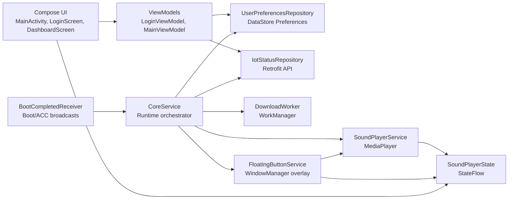

# Kiến trúc kỹ thuật AutoGreeting

Tài liệu này mô tả kiến trúc source local đang mở tại thời điểm rà soát. AutoGreeting là Android app tập trung vào background runtime: nhận tín hiệu khởi động/tắt xe, phát âm thanh đúng lúc, hiển thị điều khiển nổi, và gửi heartbeat về server.

## 1. Tổng quan kiến trúc

Source hiện tại dùng một Android application module:

```text
app/
```

Package chính:

```text
com.example.carchatbot
```

Kiến trúc thực tế là Single-Activity + MVVM nhẹ + Service-oriented background runtime.



## 2. Build và dependency

Root `build.gradle` khai báo:

- Android Gradle Plugin `8.2.2`.
- Kotlin Android `1.9.22`.
- Hilt `2.50`.

Module `app/build.gradle` khai báo:

- `compileSdk 34`
- `minSdk 24`
- `targetSdk 34`
- `applicationId "com.example.carchatbot"`
- `versionCode 1`
- `versionName "1.0"`
- `compose true`
- Compose compiler extension `1.5.8`

Dependency chính:

| Nhóm | Dependency |
| --- | --- |
| UI | Compose BOM `2024.02.00`, Material 3, material icons extended |
| Lifecycle | `lifecycle-runtime-ktx`, Activity Compose |
| DI | Hilt Android, Hilt compiler, Hilt Navigation Compose |
| Network | Retrofit 2.9.0, Gson converter, OkHttp logging interceptor |
| Background | WorkManager KTX 2.9.0 |
| Persistence | DataStore Preferences 1.2.0 |
| Test | JUnit, AndroidX Test, Espresso, Compose UI test |

## 3. Application và DI

### `CarApplication`

`CarApplication.java` là application class và được khai báo trong Manifest bằng:

```xml
android:name=".CarApplication"
```

Ứng dụng dùng Hilt nên class này phải có `@HiltAndroidApp`.

### `AppModule`

`AppModule.java` provide repository nội bộ:

- `UserPreferencesRepository`
- `IotStatusRepository`

### `NetworkModule`

`NetworkModule.java` provide:

- `Retrofit`
- `IotApiService`

Base URL hiện tại:

```text
http://103.118.28.117/api/
```

Đây là hard-coded environment. Trước release, nên đưa vào build config hoặc flavor để tránh build nhầm server.

## 4. Manifest và runtime surface

`app/src/main/AndroidManifest.xml` khai báo các bề mặt runtime:

| Thành phần | Exported | Vai trò |
| --- | --- | --- |
| `.ui.MainActivity` | `true` | Launcher Activity. |
| `.ui.YtProxyActivity` | `true` | Activity NoDisplay cho luồng YouTube shortcut, hiện flow chưa hoàn thiện. |
| `.services.CoreService` | `false` | Foreground Service điều phối background runtime. |
| `.services.SoundPlayerService` | `false` | Service phát/dừng âm thanh. |
| `.services.FloatingButtonService` | `false` | Foreground Service hiển thị overlay. |
| `.services.MyAccessibilityService` | `false` | Accessibility fallback. |
| `.services.BootCompletedReceiver` | `true` | Nhận boot/quickboot/ACC broadcast. |

Các service `CoreService` và `FloatingButtonService` dùng:

```xml
android:foregroundServiceType="specialUse"
```

và property:

```xml
android.app.PROPERTY_SPECIAL_USE_FGS_SUBTYPE
```

## 5. UI layer

### `MainActivity`

`MainActivity` làm ba việc chính:

1. Bật edge-to-edge và set Compose content.
2. Đọc `authToken` từ `UserPreferencesRepository`.
3. Điều hướng giữa `LoginScreen` và `DashboardScreen`.

Activity cũng theo dõi `isFloatingButtonEnabled`. Khi switch bật:

- Nếu Android M+ và chưa có overlay permission, mở `Settings.ACTION_MANAGE_OVERLAY_PERMISSION`.
- Nếu có quyền, start `FloatingButtonService`.

Khi switch tắt:

- Stop `FloatingButtonService`.

### `LoginScreen` và `LoginViewModel`

`LoginViewModel` expose `LoginState`:

- `Idle`
- `Loading`
- `Success`
- `Error`

Hiện `login(phone, password)` mô phỏng thành công bằng delay 1.5 giây. Nó chưa gọi `IotStatusRepository.login(...)` và chưa lưu token.

### `DashboardScreen` và `MainViewModel`

Dashboard hiển thị các cụm điều khiển:

- Lời chào (sound 1).
- Tạm biệt (sound 2).
- Tự động phát.
- Phím điều khiển nổi.
- YouTube Shortcut.
- Đăng xuất tài khoản.

`MainViewModel` expose DataStore dưới dạng `StateFlow`:

- `savedSoundUri1`
- `savedSoundUri2`
- `youtubeLink`
- `autoPlayEnabled`
- `isFloatingButtonEnabled`

Nó cũng có `selectedSoundIndex` để biết file picker đang lưu vào sound 1 hay sound 2.

## 6. Data layer

### DataStore Preferences

`UserPreferencesRepository.kt` tạo DataStore:

```kotlin
private val Context.dataStore by preferencesDataStore(name = "user_prefs")
```

Các key:

| Key | Type | Default | Vai trò |
| --- | --- | --- | --- |
| `sound_uri_1` | String | `""` | URI lời chào. |
| `sound_uri_2` | String | `""` | URI lời tạm biệt. |
| `youtube_link` | String | `""` | Link YouTube. |
| `auto_play` | Boolean | `false` ở repository, `true` làm initial state trong ViewModel | Bật/tắt tự phát. |
| `auth_token` | String? | `null` | Token đăng nhập. |
| `floating_button` | Boolean | `false` ở repository, `true` làm initial state trong ViewModel | Bật/tắt overlay. |

Lưu ý: default trong repository và initial value của `stateIn(...)` chưa hoàn toàn giống nhau. Sau khi DataStore emit, giá trị thực từ repository sẽ thắng.

### API service

`IotApiService.java` định nghĩa:

```text
POST login
POST ping
GET check-update
GET dynamic status URL
GET @Streaming dynamic download URL
```

DTO nằm trong `data/remote/dto/Models.kt`:

- `LoginRequest`
- `LoginResponse`
- `IotStatus`
- `PingResponse`
- `UpdateCheckResponse`
- `AppLogBatchRequest`
- `AppLogRequest`

### `IotStatusRepository`

`IotStatusRepository.java` hiện có:

- `login(phone, password)`: gọi API login và trả boolean success. Chưa trả token cho caller và chưa lưu token.
- `performHeartbeat(token)`: gọi `ping("Bearer " + token, AppLogBatchRequest(emptyList()))`.

## 7. Background service layer

### `BootCompletedReceiver`

Receiver chỉ route các action nằm trong allowlist:

```text
Intent.ACTION_BOOT_COMPLETED
android.intent.action.QUICKBOOT_POWERON
android.intent.action.ACC_ON
android.intent.action.ACC_OFF
```

Nếu action hợp lệ:

- Android O+ -> `context.startForegroundService(serviceIntent)`
- Android thấp hơn -> `context.startService(serviceIntent)`

Receiver gắn action gốc vào intent gửi sang `CoreService`.

### `CoreService`

`CoreService` là runtime orchestrator.

Trong `onCreate()`:

- Tạo notification channel.
- Gọi `startForeground(...)`.
- Start heartbeat task bằng `Handler(Looper.getMainLooper())`.

Heartbeat task mỗi 30 giây:

1. `performHeartbeat()`
2. `checkForUpdates()`
3. `handler.postDelayed(this, 30000)`

Trong `onStartCommand()`:

- Đọc action.
- Launch coroutine trên `serviceScope`.
- Đọc `authToken`.
- Nếu token null, log warning và `stopSelf()`.
- Nếu `isFloatingButtonEnabled` true, start `FloatingButtonService`.
- Route action sang `triggerAutoPlayGreeting(...)`.

Route sound:

| Action | Sound ID |
| --- | --- |
| `BOOT_COMPLETED` | 1 |
| `QUICKBOOT_POWERON` | 1 |
| `ACC_ON` | 1 |
| `ACC_OFF` | Không được coi là route phát tạm biệt đáng tin cậy trong tài liệu release, vì nhiều thiết bị đã tắt hoặc ngủ ngay khi mất ACC. Nếu thiết bị đặc biệt còn giữ runtime đủ lâu thì chỉ xem là fallback/chẩn đoán. |

`triggerAutoPlayGreeting(soundId)` kiểm tra:

- `autoPlayEnabled`
- `!SoundPlayerState.isPlaying.value`
- URI không blank

Sau đó start `SoundPlayerService` với `ACTION_PLAY_GREETING`.

Trong `onDestroy()`:

- Remove heartbeat callback.
- Cancel `serviceJob`.

### `FloatingButtonService`

`FloatingButtonService` là Foreground Service thứ hai, chuyên quản lý overlay.

Nó tự triển khai:

- `LifecycleOwner`
- `SavedStateRegistryOwner`
- `ViewModelStoreOwner`

Lý do: `ComposeView` cần lifecycle owner, trong khi view được gắn trực tiếp vào `WindowManager`, không nằm trong Activity.

Window params:

- Width/height: `WRAP_CONTENT`
- Type: `TYPE_APPLICATION_OVERLAY` cho Android O+, `TYPE_PHONE` cho Android thấp hơn.
- Flag: `FLAG_NOT_FOCUSABLE`
- Format: `PixelFormat.TRANSLUCENT`
- Gravity: `TOP | START`
- Vị trí ban đầu: `x = 100`, `y = 100`

UI overlay:

- Container dọc dạng pill.
- Hai action item.
- Glow khi sound đang active.
- Kéo thả bằng `detectDragGestures`.

### `SoundPlayerService`

`SoundPlayerService` nhận intent:

- `ACTION_PLAY_GREETING`
- `ACTION_STOP_GREETING`

Khi play:

- Validate URI không blank.
- Stop sound hiện tại.
- Tạo `MediaPlayer.create(this, Uri.parse(uriString))`.
- Set completion listener để reset state và stop service.
- Start playback.
- Gọi `SoundPlayerState.setPlaying(true, soundId)`.

Khi stop:

- Nếu `mediaPlayer.isPlaying`, gọi `stop()`.
- `release()`.
- Reset `mediaPlayer = null`.
- `SoundPlayerState.setPlaying(false)`.

Điểm cần hardening:

- Chưa request audio focus.
- Chưa xử lý chi tiết lỗi URI mất quyền đọc.
- Chưa có retry hoặc fallback sang default sound.

## 8. Global playback state

`SoundPlayerState.kt` là object singleton dùng `MutableStateFlow` để chia sẻ trạng thái playback:

- `isPlaying`
- `currentSoundId`

Người dùng trạng thái:

- `DashboardScreen` hiển thị sound đang active.
- `FloatingButtonService` đổi icon/tint theo sound đang phát.
- `CoreService` tránh autoplay khi đang có sound khác phát.

State này không persist qua process death.

## 9. WorkManager

`DownloadWorker.java` hiện là khung xử lý tải âm thanh:

- `doWork()` log "Starting sound download work..."
- Trả `Result.success()` nếu không có exception.
- Có helper `downloadAndSave(IotApiService api, String url, String fileName)` để download streaming response vào internal files dir.

Chưa có:

- Injection hoặc khởi tạo `IotApiService` trong worker.
- Gọi `checkUpdate`.
- Lấy token.
- Lưu URI/path sau download.
- Phân biệt sound 1/sound 2.

Vì vậy, tài liệu release không được coi sync âm thanh là production-ready.

## 10. Error handling và cleanup

Các cơ chế hiện có:

- `CoreService.performHeartbeat()` bắt exception và log lỗi.
- `CoreService.checkForUpdates()` bắt exception quanh WorkManager enqueue.
- `SoundPlayerService.playSound()` bắt exception playback và reset state.
- `DashboardScreen` bắt exception khi persist URI permission.
- `CoreService.onDestroy()` dọn handler và coroutine job.
- `FloatingButtonService.onDestroy()` remove overlay view.

Các thiếu sót cần bổ sung:

- UI error cho login thật.
- Error state cho heartbeat hoặc sync.
- Guard overlay permission trực tiếp trong `FloatingButtonService`.
- Audio focus release.
- Token expiry handling.

## 11. Rủi ro kiến trúc đã biết

| Rủi ro | Tác động | Hướng xử lý |
| --- | --- | --- |
| Login demo | App không có auth production thật. | Nối ViewModel -> repository -> DataStore token. |
| Base URL hard-code | Dễ build nhầm môi trường. | Dùng BuildConfig/flavor. |
| DownloadWorker placeholder | Sync âm thanh không thật. | Hoàn thiện worker và test mất mạng. |
| Overlay phụ thuộc permission | Service có thể fail nếu quyền bị thu hồi. | Guard trước khi start và trong service. |
| Chưa có audio focus | Âm thanh có thể chồng radio/nhạc nền. | Dùng AudioManager focus transient/duck. |
| ACC intent phân mảnh | Một số màn hình không trigger. | Thu thập logcat và mở rộng allowlist có kiểm soát. |
| Thiếu test local | Dễ regression route boot/playback. | Thêm unit/source test cho receiver, service decisions. |

## 12. Trạng thái xác minh

Đã xác minh từ source local:

- Manifest khai báo đúng các service/receiver cốt lõi.
- `CoreService` có heartbeat loop 30 giây.
- `BootCompletedReceiver` route 4 action boot/ACC.
- Floating overlay dùng Compose ngoài Activity.
- Playback dùng `MediaPlayer`.
- DataStore lưu cấu hình chính.

Chưa xác minh bằng runtime trong lần viết tài liệu này:

- Build debug trên máy hiện tại.
- Install APK trên thiết bị.
- Boot/ACC thật trên màn hình xe.
- Overlay permission flow trên Android 14.
- Heartbeat tới backend thật.
- DownloadWorker sync thật.
